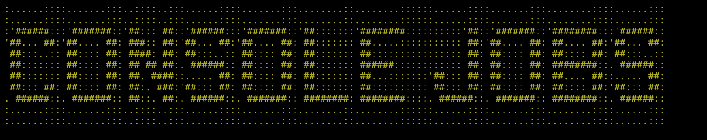
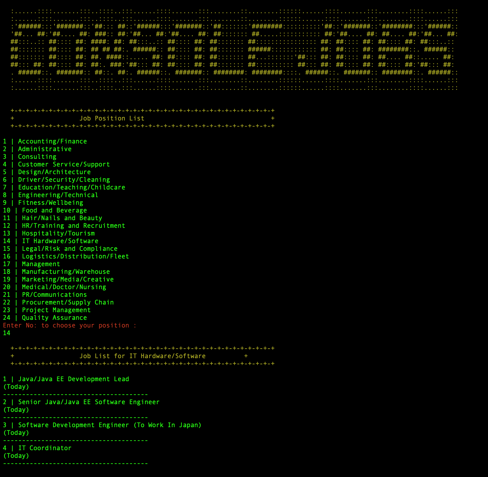

<p align="center">
 <a href="https://github.com/konyan/ruby-job-scrapper">
    
  </a>
  <h3 align="center">Console Jobs</h3>

  <p align="center">
    A Web Scraper is a program that quite literally scrapes or gathers data off of job's website. 
    <br />
    <br />
    <a href="https://github.com/othneildrew/Best-README-Template">View Demo</a>
  </p>
</p>

<!-- TABLE OF CONTENTS -->

## Table of Contents

- [About the Project](#about-the-project)
  - [Built With](#built-with)
- [Getting Started](#getting-started)
  - [Prerequisites](#prerequisites)
  - [Installation](#installation)
- [Unit Testing](#unittesting)
- [Contributing](#contributing)
- [License](#license)
- [Contact](#contact)
- [Acknowledgements](#acknowledgements)

<!-- ABOUT THE PROJECT -->

## About The Project

<a href="https://github.com/konyan/ruby-job-scrapper">
    
  </a>

This is capstone project of Microverse Ruby Curriculum.Project Name is **Console Jobs**.
Web scraping is the process of gathering information from the Internet. Even copy-pasting the lyrics of your favorite song is a form of web scraping! However, the words “web scraping” usually refer to a process that involves automation.
In my case, I gather data from one of the most popular job site from myanmar that name is [jobnet](www.jobnet.com.mm). In my project, ther is three part.

- Job Function
- Each Position Job Listing
- Job Detail

### Built With

For the whole project, I used following tools and language.

- [Ruby](https://www.ruby-lang.org/en/)
- [Nokogiri](https://nokogiri.org/index.html)
- [Colorize](https://github.com/fazibear/colorize)
- [Open Uri](https://ruby-doc.org/stdlib-2.6.3/libdoc/open-uri/rdoc/OpenURI.html)

<!-- GETTING STARTED -->

## Getting Started

This is an example of how you may give instructions on setting up your project locally. To get a local copy up and running follow these simple example steps.

### Prerequisites

This is an example of how to list things you need to use the software and how to install them.

- ruby

```txt
https://www.ruby-lang.org/en/downloads/
```

- gem

```sh
gem install nokogiri
gem install colorize
```

### Installation

1. Clone the repo

```sh
git clone https://github.com/konyan/ruby-job-scrapper.git
```

2. Install gem packages

```sh
gem install
```

3. Run main.rb file

```ruby
ruby bin/main.rb
```

<!-- UNIT TESTING -->

## Unit Testing

<!-- CONTRIBUTING -->

## Contributing

Contributions are what make the open source community such an amazing place to be learn, inspire, and create. Any contributions you make are **greatly appreciated**.

1. Fork the Project
2. Create your Feature Branch (`git checkout -b feature/AmazingFeature`)
3. Commit your Changes (`git commit -m 'Add some AmazingFeature'`)
4. Push to the Branch (`git push origin feature/AmazingFeature`)
5. Open a Pull Request

<!-- LICENSE -->

## License

Distributed under the MIT License. See `LICENSE` for more information.

<!-- CONTACT -->

## Contact

[@devkonyan](https://twitter.com/devkonyan) - devkonyan@gmail.com

Project Link: [https://github.com/your_username/repo_name](https://github.com/your_username/repo_name)

<!-- ACKNOWLEDGEMENTS -->

## Acknowledgements

- [Job Site](https://www.jobnet.com.mm/)
